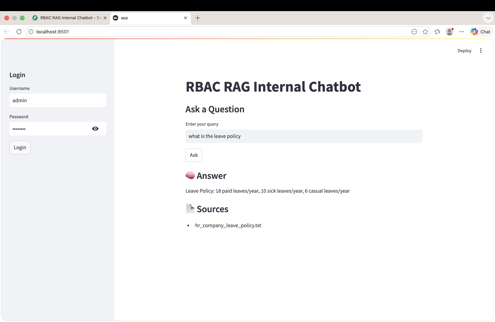
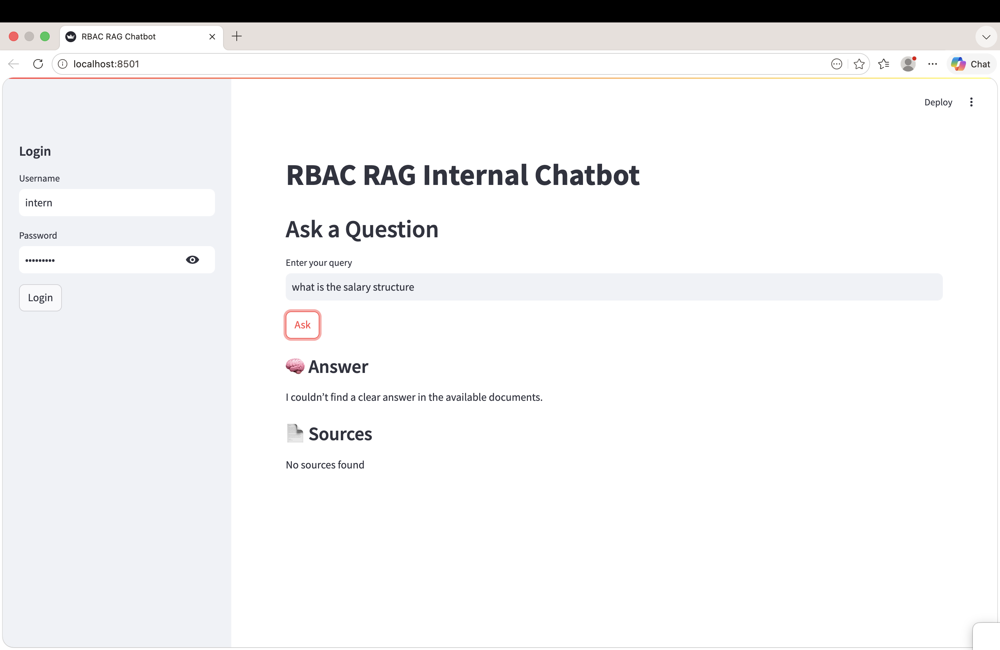
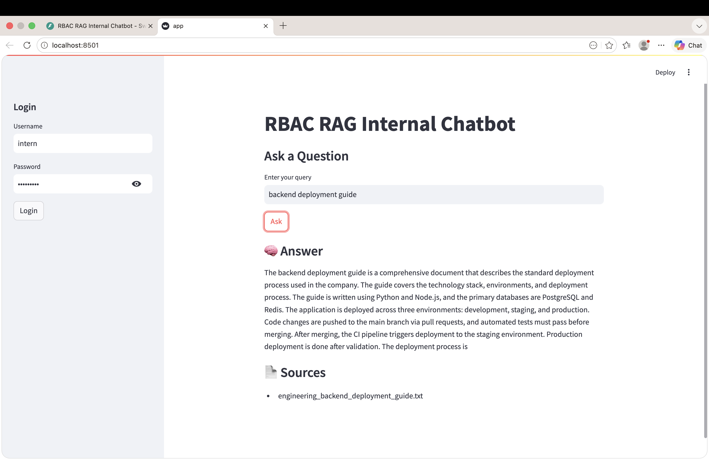
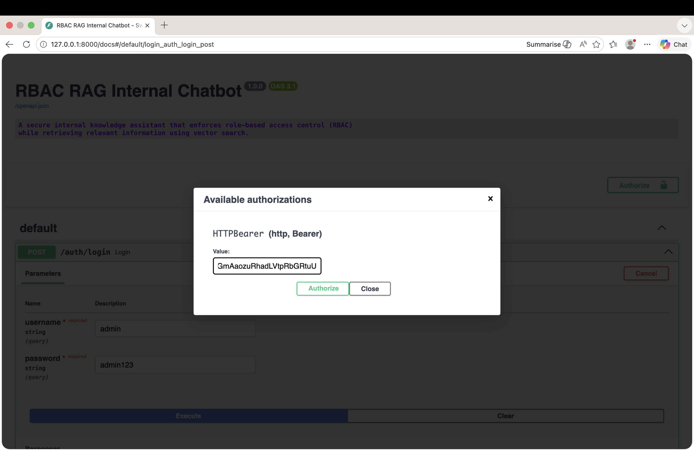

# RBAC RAG Internal Chatbot

## Overview

This project implements a **secure internal knowledge assistant** that combines **Retrieval-Augmented Generation (RAG)** with **Role-Based Access Control (RBAC)**.

The system allows users to query internal company documents while ensuring that **only authorized information is retrieved and returned**.

It is designed with a modular architecture that separates:

- Authentication and authorization  
- Document ingestion and chunking  
- Vector embedding and indexing  
- Retrieval and filtering (RBAC enforcement)  
- Answer generation  
- API backend and demo interface  

Although the system runs locally for demonstration, it reflects **production-oriented design principles for secure AI systems**.

---

## Problem Statement

In internal knowledge systems, unrestricted retrieval can expose sensitive data.

The goal of this system is to:

- Enable semantic search over internal documents  
- Enforce strict role-based access control  
- Prevent unauthorized data exposure (direct or indirect)  
- Avoid hallucinated or misleading responses  
- Provide accurate, explainable answers with sources  

---

## Demo

### 1. Streamlit Interface

Interactive chatbot interface for querying internal documents.



---

### 2. Restricted Access Example (RBAC)

An intern attempting to access salary-related information is denied.



---

### 3. Valid Access Example (Intern)

Intern successfully retrieves allowed engineering documentation.



---

### 4. API Authentication (Swagger UI)

Bearer token-based authentication flow for secured endpoints.



---

## System Architecture

The system operates in two phases:

### Offline Pipeline

- Load internal documents  
- Split documents into chunks  
- Generate embeddings using transformer models  
- Build FAISS vector index  

This phase runs once and prepares data for retrieval.

---

### Online Inference

- User submits query  
- Query is embedded into vector space  
- FAISS retrieves top-K relevant chunks  
- RBAC filters results based on role and permissions  
- Answer is generated from filtered chunks  

This phase is exposed via:

- FastAPI backend  
- Streamlit demo interface  

---

## Architecture Diagram
Documents → Chunking → Embeddings → FAISS Index

Online Phase:
User Query → Embedding → Vector Search → RBAC Filter → Answer → UI/API

---

## Technologies Used

- Python  
- FastAPI  
- Streamlit  
- FAISS  
- Sentence Transformers  
- NumPy  

---

## Repository Structure

```
project_root/
├── app/                     # FastAPI backend application
│   ├── core/                # Core RAG logic
│   │   ├── embedding_engine.py
│   │   ├── answer_generator.py
│   │   ├── document_loader.py
│   │
│   ├── routes/              # API routes
│   │   ├── chat.py
│   │
│   ├── auth/                # Authentication & RBAC
│   │   ├── routes.py
│   │
│   ├── main.py              # FastAPI entry point
│
├── config/                  # Configuration files
│   ├── company_structure.py
│
├── demo/                    # Streamlit demo application
│   ├── app.py
│
├── data/                    # Internal documents (text files)
│   ├── *.txt
│
├── assets/                  # Screenshots for README
│   ├── admin_leave_success.png
│   ├── intern_salary_blocked.png
│   ├── intern_backend_access.png
│   ├── swagger_auth.png
│
├── requirements.txt         # Python dependencies
├── .gitignore
└── README.md
```

---

## Running the Project

### 1. Install Dependencies

```
pip install -r requirements.txt
pip install python-multipart
```

### 2. Start FastAPI Backend

```
python -m uvicorn app.main:app --reload
```

Swagger UI :

```
http://127.0.0.1:8000/docs
```

### 3. Start Streamlit Demo

```
streamlit run demo/app.py
```

---

## Authentication Flow

1. Call `/auth/login` with username and password  
2. Copy the returned `access_token`  
3. Click **Authorize** in Swagger UI  
4. Paste token as:
```
Bearer <your_token>
```
5. Access `/chat` endpoint  

---

## RBAC Enforcement Logic

Access control is enforced at retrieval level:

- Role-based department access  
- File-level restrictions (e.g., salary data)  
- Query intent detection to prevent indirect leakage  

If a query targets restricted data:

```
I couldn’t find a clear answer in the available documents.
```
This ensures:

- No data leakage  
- No misleading fallback answers  

---

## Example Scenarios

| Role   | Query                     | Result |
|--------|--------------------------|--------|
| Admin  | Salary Structure         | ✅ Allowed |
| Intern | Salary Structure         | ❌ Blocked |
| Intern | Backend Deployment Guide | ✅ Allowed |
| User   | Irrelevant Query         | ❌ No Answer |

---

## Key Design Decisions

- Retrieval-first architecture (RAG)  
- RBAC enforced before answer generation  
- No hallucination fallback strategy  
- Lightweight embedding model for speed  
- Modular and extensible codebase  

---

## Failure Handling

If no valid documents are retrieved:

```
I couldn’t find a clear answer in the available documents.
```

The system prioritizes **correct refusal over incorrect answers**.

---

## Future Improvements

- JWT-based authentication  
- Persistent document storage (database)  
- Multi-turn conversational memory  
- Advanced ranking models  
- Deployment-ready containerization  

---

## Conclusion

This project demonstrates a **secure and production-aware RAG system** where:

- Retrieval is accurate  
- Access is controlled  
- Responses are reliable  

It highlights the importance of combining **AI capabilities with strict security constraints** in real-world applications.


