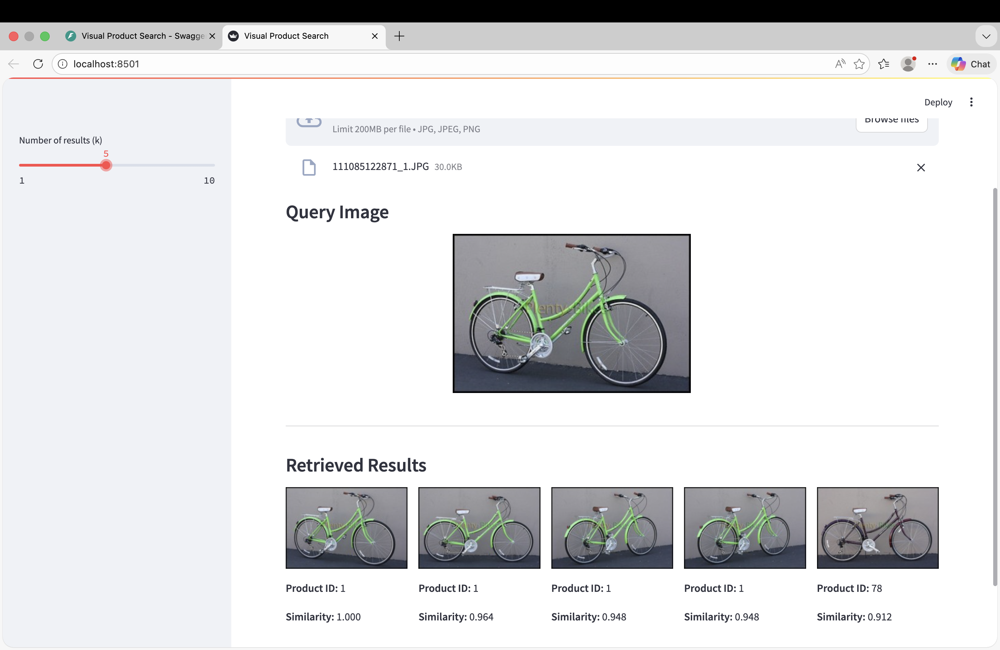
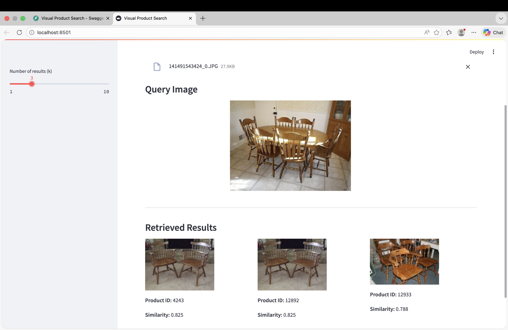

# Visual Product Search System

## Overview

This project implements an **image-based product retrieval system** using deep metric learning and FAISS indexing.

Given a query image, the system retrieves visually similar products from a large gallery dataset using embedding similarity.

The system is designed with a modular architecture that separates:

- Model training  
- Embedding extraction  
- Index construction  
- Evaluation  
- API inference  
- Demo interface  

Although this repository runs locally for experimentation and demonstration, it is structured to reflect a production-ready retrieval system.

---

## Problem Statement

In large product catalogs, traditional keyword search is often insufficient.

The goal of this system is to:

- Convert images into embedding vectors using deep convolutional networks  
- Store gallery embeddings efficiently  
- Perform fast nearest neighbor search  
- Retrieve visually similar products based on embedding similarity  

The system is evaluated using Recall@K metrics.

---

## Demo

### 1. Streamlit Interface

The Streamlit application allows users to upload a query image and retrieve visually similar products.



---

### 2. FastAPI Backend (Swagger Documentation)

The backend exposes a `/search` endpoint returning ranked results with similarity scores.


---

### 3. Retrieval Comparison Example

Example query image and top-K retrieved visually similar products.



---

## System Architecture

The system is divided into two major phases:

### Offline Pipeline

- Train metric learning model  
- Extract embeddings for gallery and query images  
- Build FAISS index from gallery embeddings  
- Save artifacts for inference  

This phase runs once per experiment and produces reusable artifacts.

### Online Inference

- User uploads a query image  
- Embedding is generated in real time  
- FAISS index retrieves top-K similar products  
- Similarity scores are returned  

This phase is exposed via:

- FastAPI backend  
- Streamlit demo interface  

---

## Architecture Diagram

```
Offline Phase:
Dataset → Model Training → Embedding Extraction → FAISS Index → Artifacts

Online Phase:
User Image → FastAPI → Embedding → FAISS Search → Ranked Results → Streamlit UI
```

---

## Technologies Used

- **Python**
- **PyTorch** – Deep metric learning
- **ResNet18 / ResNet50** – Backbone feature extractors
- **FAISS** – Efficient similarity search
- **FastAPI** – Inference API
- **Streamlit** – Demo interface
- **NumPy & Pandas** – Data processing

---

## Repository Structure

```
visual-product-search/
├── api/                 # FastAPI inference backend
├── demo/                # Streamlit demo interface
├── src/                 # Core training, evaluation, and inference logic
├── configs/             # Configuration files
├── data/                # Dataset structure and splits
├── artifacts/           # Generated models, embeddings, FAISS index (gitignored)
├── monitoring/          # Monitoring design documentation
├── assets/              # Screenshots for README
├── requirements.txt
├── .gitignore
└── README.md
```

---

## Backbone Experiments

This project supports multiple backbone experiments.

Example artifact layout:

```
artifacts/
├── resnet18/
├── resnet50/
```

Each backbone maintains its own:

- Trained model  
- Extracted embeddings  
- FAISS index  

This enables controlled comparison between models.

---

## Evaluation

Retrieval quality is measured using:

- Recall@1  
- Recall@5  
- Recall@10  

FAISS-based evaluation includes:

- Average query time  
- Recall comparison between index types (Flat vs IVF)

Example command:

```
python -m src.evaluation.evaluate_faiss
```

---

## Performance Results

| Model    | Index Type | Recall@1 | Recall@5 | Recall@10 | Avg Query Time |
|----------|------------|----------|----------|-----------|----------------|
| ResNet50 | Flat       | 0.1662   | 0.5420   | 0.5917    | 0.000086 sec   |
| ResNet50 | IVF        | 0.1641   | 0.5316   | 0.5792    | 0.000242 sec   |
| ResNet18 | Flat       | 0.1633   | 0.5284   | 0.5782    | 0.000086 sec   |

Flat index provides slightly higher recall, while IVF enables scalable approximate search.

---

## Running the Project

### 1. Install Dependencies

```
pip install -r requirements.txt
```

### 2. Train Model

```
python -m src.training.train
```

### 3. Extract Embeddings

```
python -m src.evaluation.extract_embeddings
```

### 4. Build FAISS Index

```
python -m src.inference.build_index
```

### 5. Run API Backend

```
uvicorn api.main:app --reload
```

API documentation available at:

```
http://127.0.0.1:8000/docs
```

### 6. Run Streamlit Demo

```
streamlit run demo/app.py
```

The demo allows:

- Query image upload  
- Adjustable top-K retrieval  
- Visualization of similarity scores  

---

## Dataset

This project was developed using the **Stanford Online Products** dataset.

Dataset files are not included in this repository.

To reproduce experiments:

1. Download the dataset  
2. Place it inside `data/raw/`  
3. Generate splits inside `data/splits/`  

---

## Monitoring & Production Considerations

The repository includes a `monitoring/` folder describing:

- Retrieval quality tracking  
- Latency monitoring  
- Embedding drift detection  
- System health metrics  

While not fully implemented, the structure reflects production-aware system design.

---

## Key Design Decisions

- Embeddings are L2-normalized to enable cosine similarity search  
- FAISS index type is configurable (Flat or IVF)  
- Artifacts are isolated per backbone to prevent experiment contamination  
- Large files and datasets are excluded from version control  
- Configuration-driven architecture ensures reproducibility  

---

## Reproducibility

To rebuild the system from scratch:

1. Train  
2. Extract embeddings  
3. Build FAISS index  
4. Run API or demo  

No manual artifact editing is required.

---

## Future Improvements

- Automated experiment tracking  
- Real-time monitoring dashboards  
- GPU-based FAISS acceleration  
- Model distillation for faster inference  
- Deployment-ready containerization  

---

This project demonstrates end-to-end development of a scalable visual retrieval system, from model training to API-based inference and interactive demo.